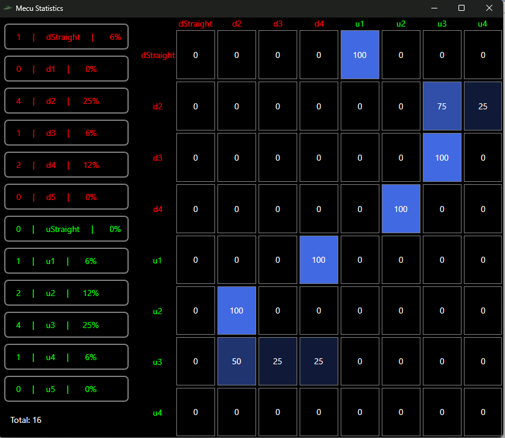

# BeanCounter

BeanCounter is a helper tool to count M&Ms :). You can see the chances for a follow up color.

## Screenshot



## Features

- Left click on the left side buttons increments that item
- Right click on the left general area undo the last add
- Extensible architecture for custom analysis:
    - the app generates an ordered log file of the succession that can be interpreted as a Markov chain with the right tool to give an image on how items are occuring

## Getting Started

1. **Clone the repository:**
    ```sh
    git clone https://github.com/[your-username]/BeanCounter.git
    ```
2. **Navigate to the project directory:**
    ```sh
    cd BeanCounter
    ```
3. **Build the project:**
    ```sh
    dotnet build
    ```
4. **Run the application:**
    ```sh
    dotnet run
    ```

## Usage

1.  Run the application:

    ```bash
    dotnet run
    ```
The application allows to load a custom list of items by providing the path to the file name containing each item on a row in the format `name | parsable_color_name_or_code` 
Sample of input file:
```
cookie byte|green
milk gulp|#FAFF0A
```
2. Click on the buttons and discover probabilities.

## Contributing

Contributions are welcome! Please open issues or submit pull requests for new features, bug fixes, or improvements.

## License

This project is licensed under the MIT License.

